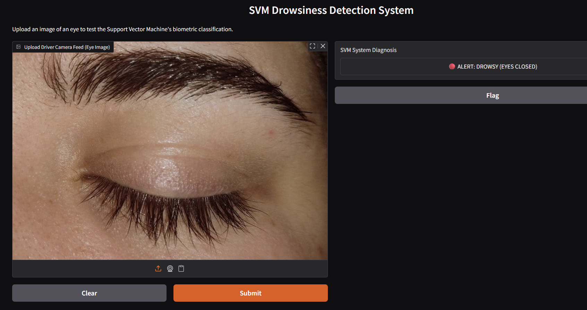

# SVM Driver Drowsiness Detection System

A lightweight, real-time biometric image classification pipeline built with Support Vector Machines (SVM) and Histogram of Oriented Gradients (HOG).

## Live Dashboard Demo
Below is a demonstration of the Gradio dashboard successfully classifying a biometric eye state using the trained SVM model.

## Tech Stack
* **Algorithm:** Support Vector Machine (Scikit-Learn)
* **Feature Extraction:** HOG (skimage)
* **UI/Dashboard:** Gradio
* **Image Processing:** OpenCV
